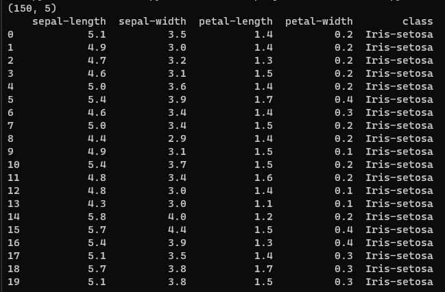
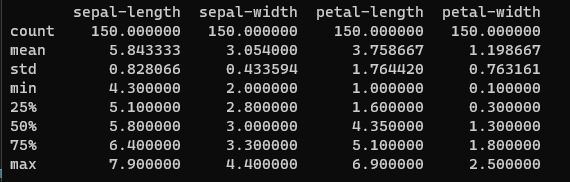
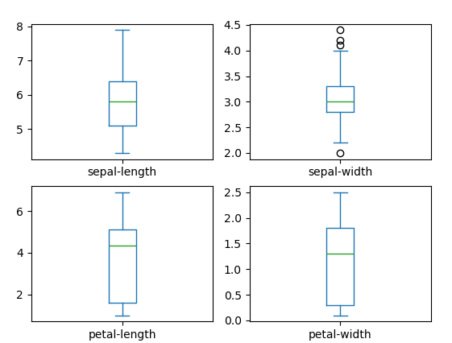
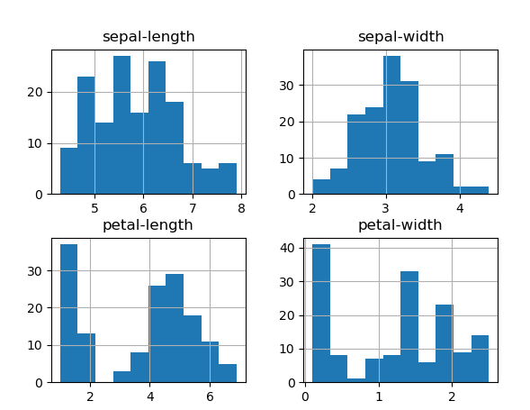
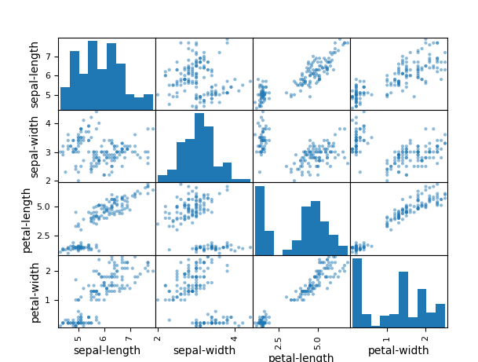
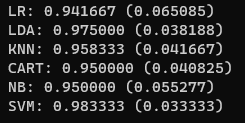
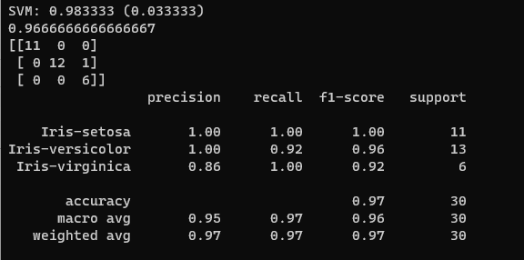

# Goal

The iris species have been classified into three categories that are setosa, versicolor, or virginica.

The goal is to create a machine learning model that can learn from the measurements of these irises whose species are already known so that we can predict the species for the new irises that she has founded or in other words if she will find any new iris flower.

thanks to https://machinelearningmastery.com/machine-learning-in-python-step-by-step/
and https://www.linkedin.com/pulse/start-your-first-machine-learning-project-iris-flower-ritwik-dalmia/ for providing this course

# Steps to follow

1. [Installing the Python and SciPy platform](#installing-the-python-and-scipy-platform)
2. [Loading the dataset](#load-the-data)
    1. [Import Libraries](#import-libraries)
    2. [Load Dataset](#load-dataset)
3. [Summarizing the dataset](#summarize-the-dataset)
    1. [Dimensions of Dataset](#dimensions-of-dataset)
    2. [Peek at the Data](#peek-at-the-data)
    3. [Statistical Summary](#statistical-summary)
    4. [Class Distribution](#class-distribution)
4. [Visualizing the dataset](#data-visualization)
    1. [Univariate Plots](#univariate-plots)
    2. [Multivariate Plots](#multivariate-plots)
5. [Evaluating some algorithms](#evaluating-some-algorithms)
    1. [Create a Validation Dataset](#create-a-validation-dataset)
    2. [Build Models](#build-models)
    3. [Select Best Model](#select-best-model)
6. [Making some predictions](#making-some-predictions)
    1. [Make Predictions](#make-predictions)
    2. [Evaluate Predictions](#evaluate-predictions)

## Installing the Python and SciPy platform

The following libraries are required for this project:
* scipy
* numpy
* matplotlib
* pandas
* sklearn


## Load The Data

Iris flowers dataset will be used.

This dataset is famous because it is used as the “hello world” dataset in machine learning and statistics by pretty much everyone.

The dataset contains 150 observations of iris flowers. There are four columns of measurements of the flowers in centimeters. The fifth column is the species of the flower observed. All observed flowers belong to one of three species.

### Import Libraries

``` python
from pandas import read_csv
from pandas.plotting import scatter_matrix
from matplotlib import pyplot as plt
from sklearn.model_selection import train_test_split
from sklearn.model_selection import cross_val_score
from sklearn.model_selection import StratifiedKFold
from sklearn.metrics import classification_report
from sklearn.metrics import confusion_matrix
from sklearn.metrics import accuracy_score
from sklearn.linear_model import LogisticRegression
from sklearn.tree import DecisionTreeClassifier
from sklearn.neighbors import KNeighborsClassifier
from sklearn.discriminant_analysis import LinearDiscriminantAnalysis
from sklearn.naive_bayes import GaussianNB
from sklearn.svm import SVC
```

### Load Dataset

Pandas will be used to load the data, also pandas next will be used to explore the data both with descriptive statistics and data visualization.

```python
# Load dataset
path = "./testData/iris.csv"
names = ['sepal-length', 'sepal-width', 'petal-length', 'petal-width', 'class']
dataset = read_csv(path, names=names)
```

## Summarize the Dataset

In this step we are going to take a look at the data a few different ways:

1. Dimensions of the dataset.
2. Peek at the data itself.
3. Statistical summary of all attributes.
4. Breakdown of the data by the class variable.

### Dimensions of Dataset

A quick idea of how many instances (rows) and how many attributes (columns) the data contains can be get using the shape property.

```python
# shape
print(dataset.shape)
```

Outpu will be (150,5) => 150 instances and 5 attributes

### Peek at the Data

It can be achieved using 
```python
# head
print(dataset.head(20))
```




### Statistical Summary

This includes the count, mean, the min and max values as well as some percentiles.
```pythons
# descriptions
print(dataset.describe())
```




### Class Distribution

Let’s now take a look at the number of instances (rows) that belong to each class. We can view this as an absolute count.

```python
# class distribution
print(dataset.groupby('class').size())
```


## Data Visualization

We are going to look at two types of plots:

* Univariate plots to better understand each attribute.
* Multivariate plots to better understand the relationships between attributes.


### Univariate Plots 

Given that the input variables are numeric, we can create box and whisker plots of each.

```python
# box and whisker plots
dataset.plot(kind='box', subplots=True, layout=(2,2), sharex=False, sharey=False)
plt.show()
```



We can also create a histogram of each input variable to get an idea of the distribution.
```python
# histograms
dataset.hist()
plt.show()
```



### Multivariate Plots

First, let’s look at scatterplots of all pairs of attributes. This can be helpful to spot structured relationships between input variables.
```python
# scatter plot matrix
scatter_matrix(dataset)
plt.show()
```




## Evaluating some algorithms

1. Separate out a validation dataset.
2. Set-up the test harness to use 10-fold cross validation.
3. Build multiple different models to predict species from flower measurements
4. Select the best model.


### Create a Validation Dataset
We need to know that the model we created is good.

Later, we will use statistical methods to estimate the accuracy of the models that we create on unseen data. We also want a more concrete estimate of the accuracy of the best model on unseen data by evaluating it on actual unseen data.

That is, we are going to hold back some data that the algorithms will not get to see and we will use this data to get a second and independent idea of how accurate the best model might actually be.

We will split the loaded dataset into two, 80% of which we will use to train, evaluate and select among our models, and 20% that we will hold back as a validation dataset.

```python
# Split-out validation dataset
array = dataset.values
X = array[:,0:4]
y = array[:,4]
X_train, X_validation, Y_train, Y_validation = train_test_split(X, y, test_size=0.20, random_state=1)
```

You now have training data in the X_train and Y_train for preparing models and a X_validation and Y_validation sets that we can use later.

Notice that we used a python slice to select the columns in the NumPy array

### Build Models

We don’t know which algorithms would be good on this problem or what configurations to use.

We get an idea from the plots that some of the classes are partially linearly separable in some dimensions, so we are expecting generally good results.

Let’s test 6 different algorithms:

* Logistic Regression (LR)
* Linear Discriminant Analysis (LDA)
* K-Nearest Neighbors (KNN).
* Classification and Regression Trees (CART).
* Gaussian Naive Bayes (NB).
* Support Vector Machines (SVM).

This is a good mixture of simple linear (LR and LDA), nonlinear (KNN, CART, NB and SVM) algorithms.

```python
# Spot Check Algorithms
models = []
models.append(('LR', LogisticRegression(solver='liblinear', multi_class='ovr')))
models.append(('LDA', LinearDiscriminantAnalysis()))
models.append(('KNN', KNeighborsClassifier()))
models.append(('CART', DecisionTreeClassifier()))
models.append(('NB', GaussianNB()))
models.append(('SVM', SVC(gamma='auto')))
# evaluate each model in turn
results = []
names = []
for name, model in models:
 kfold = StratifiedKFold(n_splits=10, random_state=1, shuffle=True)
 cv_results = cross_val_score(model, X_train, Y_train, cv=kfold, scoring='accuracy')
 results.append(cv_results)
 names.append(name)
 print('%s: %f (%f)' % (name, cv_results.mean(), cv_results.std()))
```



### Select Best Model

We now have 6 models and accuracy estimations for each. We need to compare the models to each other and select the most accurate.

Using the previous output, we can see that 'Support Vector Machines' algorithm is the most accurate (0.98333333 => 98%)

## Making some predictions

SVM algorithm will be used since it is the most accurate model.

This will give us an independent final check on the accuracy of the best model. It is valuable to keep a validation set just in case you made a slip during training, such as overfitting to the training set or a data leak. Both of these issues will result in an overly optimistic result.

### Make Predictions

We can fit the model on the entire training dataset and make predictions on the validation dataset.

```python
# Make predictions on validation dataset
model = SVC(gamma='auto')
model.fit(X_train, Y_train)
predictions = model.predict(X_validation)
```

### Evaluate Predictions

We can evaluate the predictions by comparing them to the expected results in the validation set, then calculate classification accuracy, as well as a confusion matrix and a classification report.

```python
# Evaluate predictions
print(accuracy_score(Y_validation, predictions))
print(confusion_matrix(Y_validation, predictions))
print(classification_report(Y_validation, predictions))
```



We can see that the accuracy is 0.966 or about 96% on the hold out dataset.

The confusion matrix provides an indication of the errors made.

Finally, the classification report provides a breakdown of each class by precision, recall, f1-score and support showing excellent results (granted the validation dataset was small).
